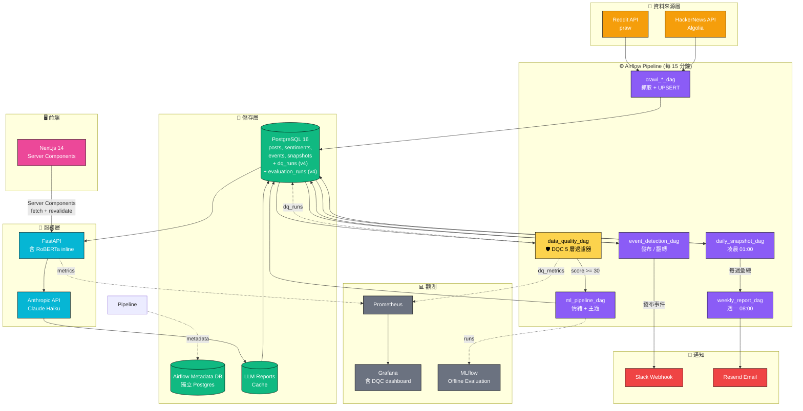
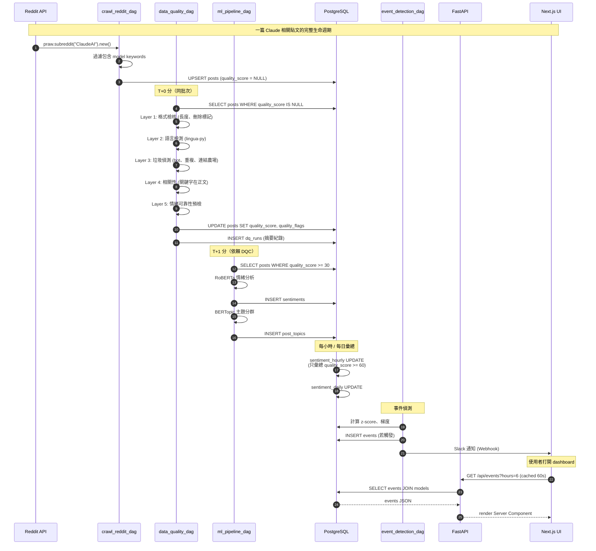
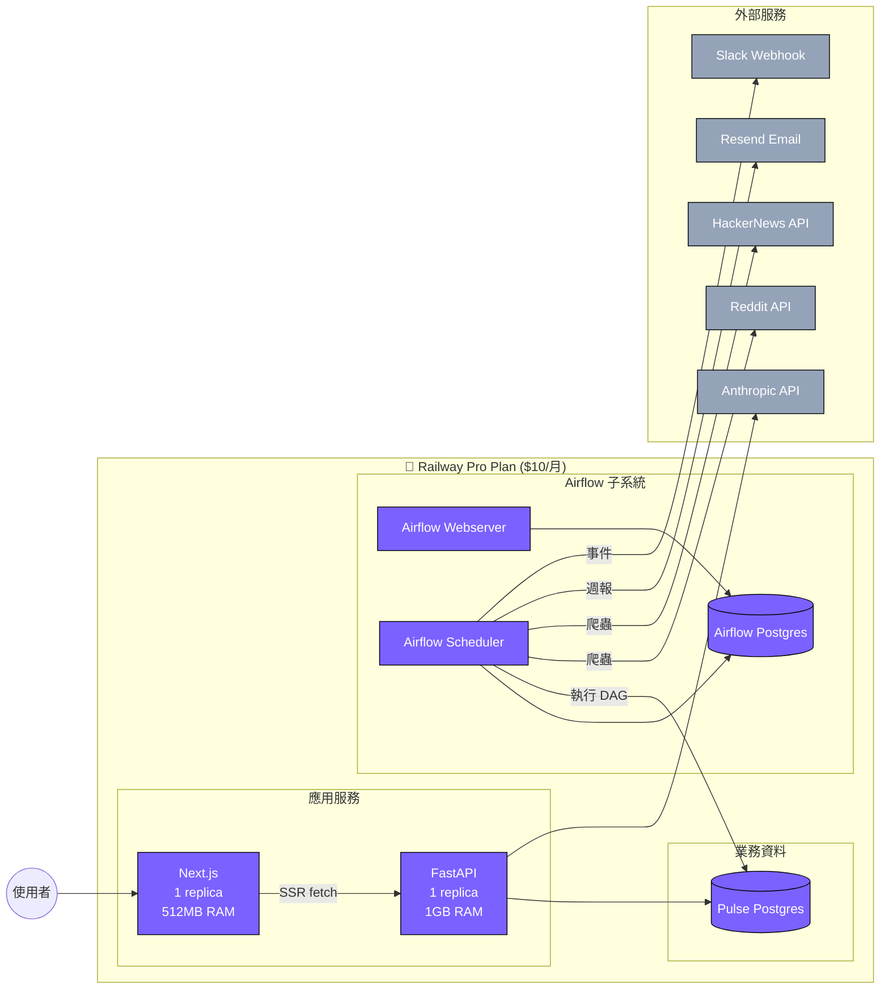
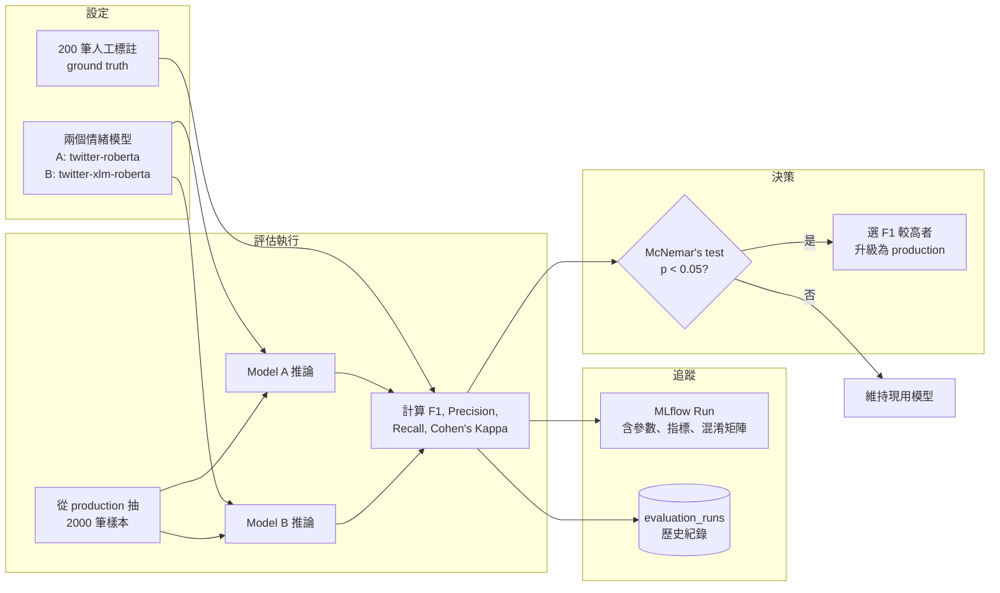
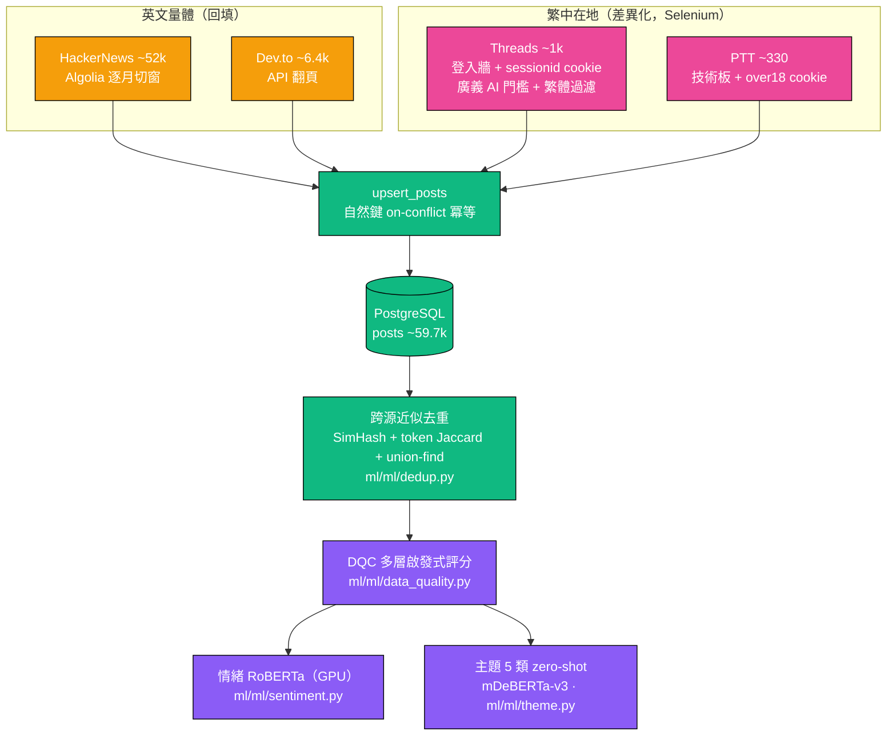
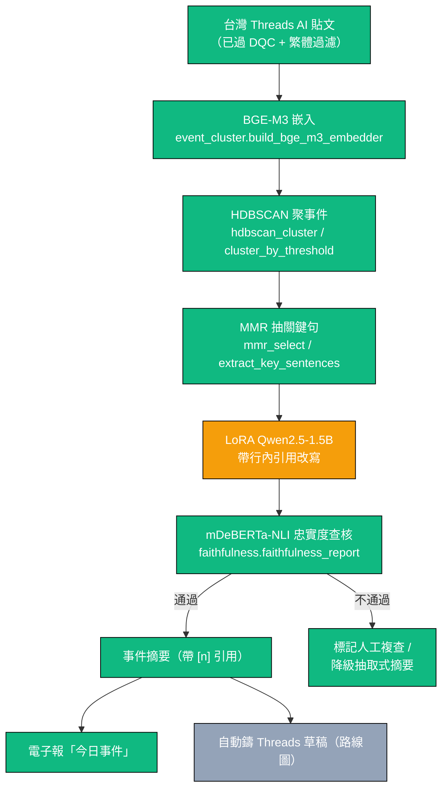
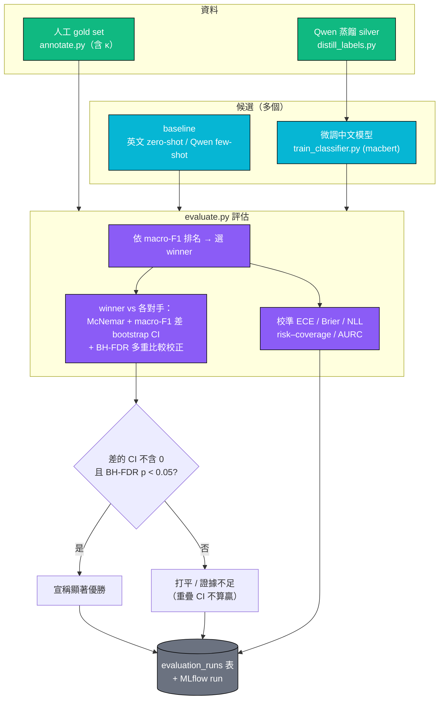

# Pulse 系統架構

> 本檔案使用 Mermaid 語法，於 GitHub 自動 render。
>
> ⚠️ **注意（產品已 pivot）**：下方第 1–5 節保留早期 v4 規劃圖（Reddit / HackerNews 來源、
> Anthropic API、英文 twitter-roberta 情緒），那些**已不代表現況**。專案已轉向
> **繁中優先、Threads 主力來源、地端 LLM（無雲端 API）、技術核心 = 事件忠實摘要**。
> 反映現況的圖請看 **第 5b 節（資料取得與語料庫 ~59.7k）**、**第 6 節（事件忠實摘要管線）** 與 **第 7 節（現行 Offline Evaluation 流程）**，
> 整體定位見 [README](../README.md) 與 [事件忠實摘要個案研究](case-study-faithful-event-summarizer.md)。

## 1. 高層次系統架構



**v4 變更標記**：
- 🟡 黃色節點 `DQC`：v4 新增的資料品質檢核
- 🟢 PostgreSQL 表新增 `dq_runs`、`evaluation_runs`
- Pipeline 框架從 Prefect 改為 Apache Airflow

---

## 2. 資料流：單篇貼文生命週期



---

## 3. 部署架構（Railway）



---

## 4. DQC 內部流程

```mermaid
flowchart TD
    Start([新貼文進入 DQC]) --> L1{Layer 1<br/>長度 >= 20?<br/>非 [deleted]?}
    L1 -->|否| Discard[score = 0<br/>flags = [TOO_SHORT, DELETED]<br/>丟棄]
    L1 -->|是| L2{Layer 2<br/>語言 = 英文?<br/>confidence > 0.8?}
    L2 -->|否| MarkLow[score -= 20~80<br/>flag: NON_ENGLISH]
    L2 -->|是| L3{Layer 3<br/>非 bot?<br/>非重複?<br/>連結比例 < 70%?}
    L3 -->|否| MarkSpam[score -= 40~70<br/>flag: LIKELY_BOT 等]
    L3 -->|是| L4{Layer 4<br/>關鍵字在正文?}
    L4 -->|否| MarkIrrel[score -= 30<br/>flag: KEYWORD_NOT_IN_BODY]
    L4 -->|是| L5{Layer 5<br/>情緒可靠?}
    L5 -->|否| MarkUnreliable[score -= 20<br/>flag: SARCASM_DETECTED]
    L5 -->|是| Pass[score = 100<br/>flags = []]

    MarkLow --> Final
    MarkSpam --> Final
    MarkIrrel --> Final
    MarkUnreliable --> Final
    Pass --> Final

    Final{最終分數}
    Final -->|>= 60| HighQ[納入彙總、事件偵測]
    Final -->|30-59| MidQ[分析但不彙總<br/>供 debug]
    Final -->|< 30| Drop[丟棄]

    classDef pass fill:#10B981,color:#fff
    classDef warn fill:#F59E0B,color:#fff
    classDef fail fill:#EF4444,color:#fff
    class HighQ,Pass pass
    class MidQ,MarkLow,MarkSpam,MarkIrrel,MarkUnreliable warn
    class Drop,Discard fail
```

---

## 5. Offline Evaluation 流程



---

## 5b. 資料取得與語料庫（現況，~59.7k 篇）

> 反映現況的資料層。DB 已累積約 6 萬篇多源 AI 貼文；英文量體（HN / Dev.to）給下游 ML 與去重訓練量，
> 繁中在地訊號（Threads / PTT）是差異化核心與事件摘要的輸入子集。

| 來源 | 規模（約） | 語言 | 取得方式 | 程式 |
|------|-----------|------|----------|------|
| HackerNews | ~52k | 英 | Algolia API，**逐月切窗**繞單查詢 ~1000 筆上限，UPSERT 冪等可重跑 | `scripts/bulk_backfill.py` · `workers/crawlers/hackernews.py` |
| Dev.to | ~6.4k | 英 | API 翻頁（整段範圍只跑一次，避免重抓近期頁） | `scripts/bulk_backfill.py` · `workers/crawlers/devto.py` |
| **Threads** | **~1k** | **繁中（台灣）** | **Selenium 真瀏覽器 + sessionid cookie 繞登入牆；廣義 AI 門檻 + 繁體過濾擋簡中** | `workers/crawlers/threads.py` |
| PTT | ~330 | 繁中 | Selenium 真瀏覽器翻技術板 index（年齡牆板注入 over18 cookie） | `scripts/crawl_ptt.py` |



**已跑出的下游與一個誠實發現**：HN/Dev.to 英文量體已跑完跨源去重、情緒（`cardiffnlp/twitter-roberta`，GPU）與主題（`MoritzLaurer/mDeBERTa-v3-base-mnli-xnli` zero-shot 5 類）。主題分布**嚴重偏向「新工具」**——這個偏斜正是 zero-shot 在此 taxonomy 上的弱點，也**直接成為下一步監督式微調 `hfl/chinese-macbert-base`** 取代 zero-shot 的動機（見 §7 與 [README](../README.md) 路線圖）。

**已知問題（地端 LLM）**：PyTorch GPU 推論正常（情緒 / 分類已實跑）；但 Ollama 內附的 CUDA build 目前會 crash，使需要 Ollama 的「真實模式」翻譯與摘要暫時受阻——管線純邏輯與假模型路徑不受影響。

---

## 6. 事件忠實摘要管線（現行技術核心）

> Pulse 的技術核心：把同一事件的多篇 Threads 貼文聚成叢集，抽關鍵句，用 LoRA 微調的繁中小模型
> 帶引用改寫，再經 NLI 忠實度查核。**非 RAG**。詳見 [個案研究](case-study-faithful-event-summarizer.md)。



忠實度查核把「忠實」拆成四個可量測面向（`ml/ml/faithfulness.py`）：句級 NLI 蘊含、句級 NLI 矛盾、
行內引用有效性、來源覆蓋率，匯總成 `faithfulness_score ∈ [0,1]`。聚類 + 抽句（`ml/ml/event_cluster.py`）
與忠實度查核皆寫成**純函式 + 注入式重模型**，不裝 BGE-M3 / hdbscan / transformers 也能單元測試核心邏輯。

---

## 7. 現行 Offline Evaluation 流程（N 候選 bake-off）

> 取代第 5 節的舊版（那是英文二模型對比）。現行做法：多候選在同一 gold set 上排名 + 配對顯著性檢定。
> 程式：`scripts/evaluate.py` + `ml/ml/metrics.py`，寫入 `evaluation_runs` 表。報告範本見
> [evaluation-report-template.md](evaluation-report-template.md)。



這不是線上 A/B（無使用者流量分流），是 Offline Evaluation —— 多模型在同一份 labeled set 的配對比較
（見 [ADR-008](decisions/008-offline-evaluation.md)）。同一套統計（McNemar + bootstrap CI + BH-FDR）
也用於事件摘要 bake-off，只是主指標換成忠實度 + 盲測偏好。

---

## 8. 設計考量摘要

| 設計決策 | 為什麼 |
|---------|--------|
| Airflow 取代 Prefect | 接軌中大型企業主流，履歷加分（採納 Mentor #4） |
| DQC 在情緒分析前 | 雜訊不該進 ML pipeline（採納 Mentor #1） |
| Airflow Metadata DB 獨立 | 不與業務 DB 混用，避免互相干擾 |
| 情緒模型 inline 於 FastAPI | 個人流量規模，不需要拆獨立 service |
| DQC quality_score 三分檔 | 給「分析但不彙總」的緩衝區，避免誤殺 |
| Offline Eval 不是 A/B Test | 業界精確術語（採納 Mentor #3） |

完整決策紀錄見 `docs/decisions/`。
