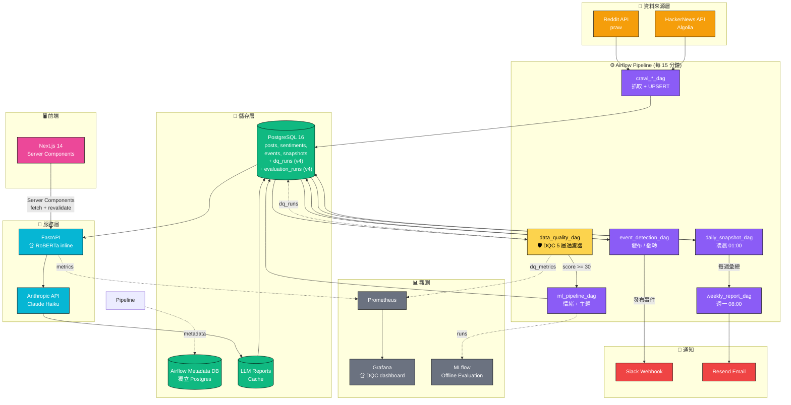
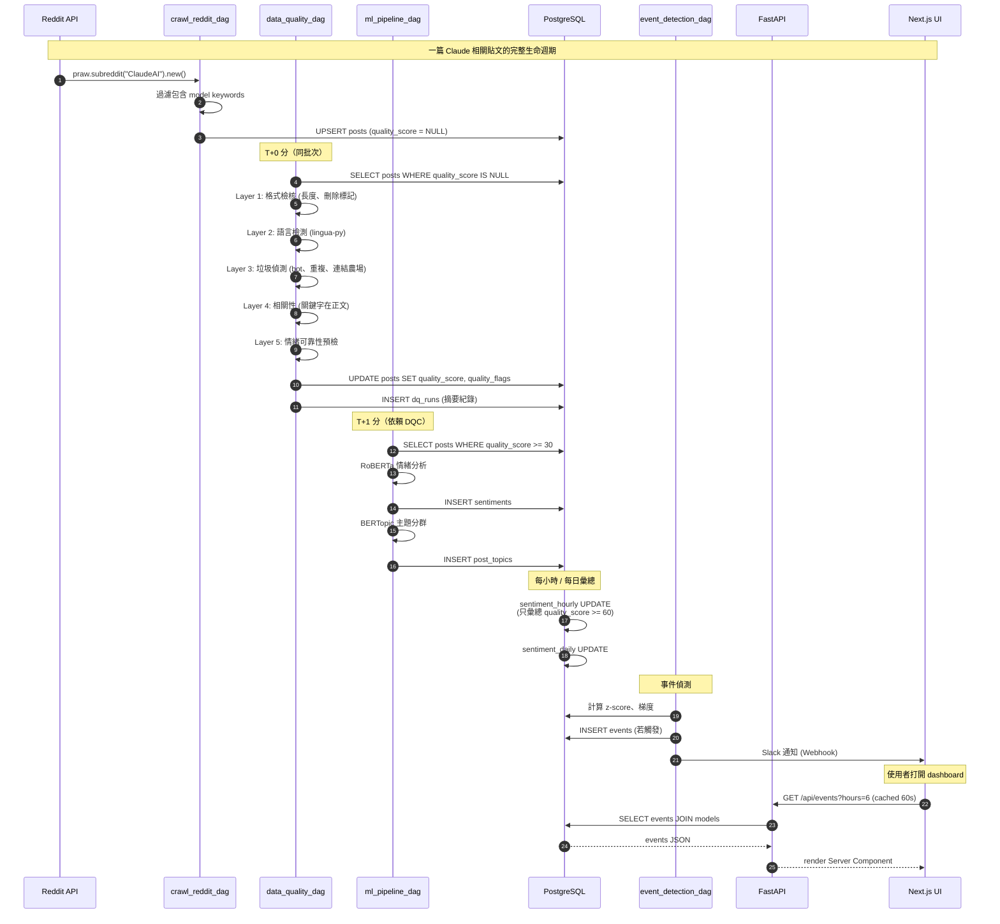
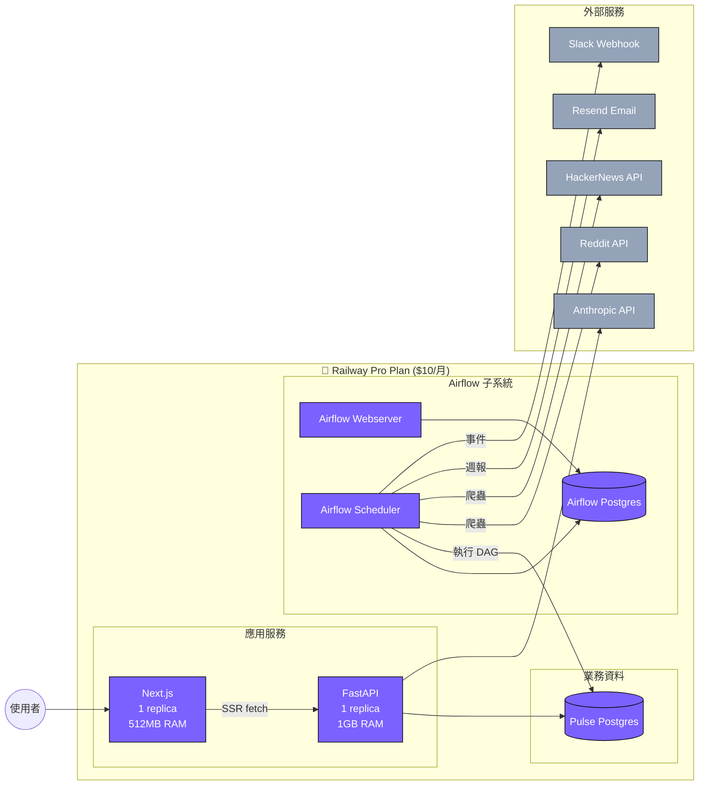
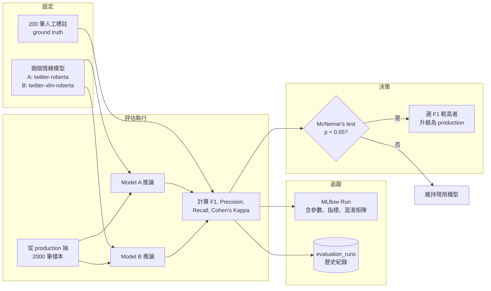

# Pulse 系統架構

> v4.0 — 採納 Mentor Review #2 建議補上的視覺化架構圖。
> 本檔案使用 Mermaid 語法，於 GitHub 自動 render。

## 1. 高層次系統架構



**v4 變更標記**：
- 🟡 黃色節點 `DQC`：v4 新增的資料品質檢核
- 🟢 PostgreSQL 表新增 `dq_runs`、`evaluation_runs`
- Pipeline 框架從 Prefect 改為 Apache Airflow

---

## 2. 資料流：單篇貼文生命週期



---

## 3. 部署架構（Railway）



---

## 4. DQC 內部流程

```mermaid
flowchart TD
    Start([新貼文進入 DQC]) --> L1{Layer 1<br/>長度 >= 20?<br/>非 [deleted]?}
    L1 -->|否| Discard[score = 0<br/>flags = [TOO_SHORT, DELETED]<br/>丟棄]
    L1 -->|是| L2{Layer 2<br/>語言 = 英文?<br/>confidence > 0.8?}
    L2 -->|否| MarkLow[score -= 20~80<br/>flag: NON_ENGLISH]
    L2 -->|是| L3{Layer 3<br/>非 bot?<br/>非重複?<br/>連結比例 < 70%?}
    L3 -->|否| MarkSpam[score -= 40~70<br/>flag: LIKELY_BOT 等]
    L3 -->|是| L4{Layer 4<br/>關鍵字在正文?}
    L4 -->|否| MarkIrrel[score -= 30<br/>flag: KEYWORD_NOT_IN_BODY]
    L4 -->|是| L5{Layer 5<br/>情緒可靠?}
    L5 -->|否| MarkUnreliable[score -= 20<br/>flag: SARCASM_DETECTED]
    L5 -->|是| Pass[score = 100<br/>flags = []]

    MarkLow --> Final
    MarkSpam --> Final
    MarkIrrel --> Final
    MarkUnreliable --> Final
    Pass --> Final

    Final{最終分數}
    Final -->|>= 60| HighQ[納入彙總、事件偵測]
    Final -->|30-59| MidQ[分析但不彙總<br/>供 debug]
    Final -->|< 30| Drop[丟棄]

    classDef pass fill:#10B981,color:#fff
    classDef warn fill:#F59E0B,color:#fff
    classDef fail fill:#EF4444,color:#fff
    class HighQ,Pass pass
    class MidQ,MarkLow,MarkSpam,MarkIrrel,MarkUnreliable warn
    class Drop,Discard fail
```

---

## 5. Offline Evaluation 流程



---

## 6. 設計考量摘要

| 設計決策 | 為什麼 |
|---------|--------|
| Airflow 取代 Prefect | 接軌中大型企業主流，履歷加分（採納 Mentor #4） |
| DQC 在情緒分析前 | 雜訊不該進 ML pipeline（採納 Mentor #1） |
| Airflow Metadata DB 獨立 | 不與業務 DB 混用，避免互相干擾 |
| 情緒模型 inline 於 FastAPI | 個人流量規模，不需要拆獨立 service |
| DQC quality_score 三分檔 | 給「分析但不彙總」的緩衝區，避免誤殺 |
| Offline Eval 不是 A/B Test | 業界精確術語（採納 Mentor #3） |

完整決策紀錄見 `docs/decisions/`。
