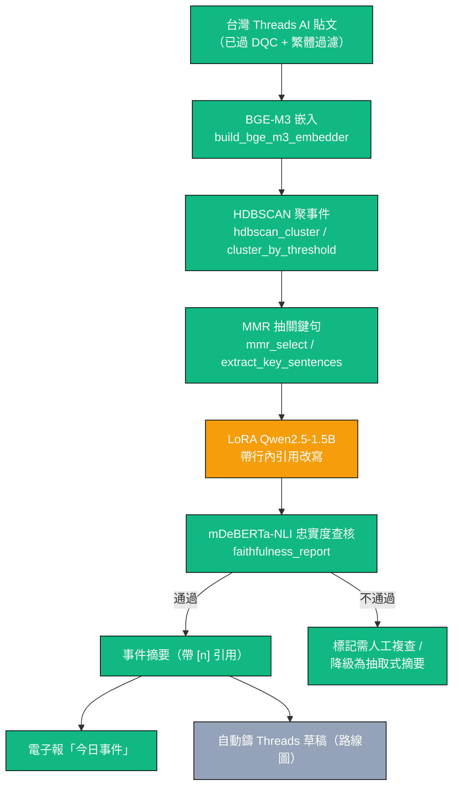

# 個案研究：事件忠實摘要（Faithful Event Summarizer）

> Pulse 的技術核心。把台灣 Threads 上**散落、重複、彼此回應**的 AI 討論，聚成「事件」，再用一個**自訓的繁中小模型**生成「帶行內來源引用、且可被機器驗證忠於來源」的事件摘要。
>
> 一句話：**不是檢索後 prompt（RAG），而是自訓生成模型 + 多文件摘要 + 忠實度專門化。**

---

## 1. 問題與「為何不是 RAG」

### 問題

台灣的 AI 討論高度集中在 Threads，但訊號很「髒」：

- **同一事件被多人重複轉述**（「OpenAI 又出新模型了」會有幾十篇近乎重複的貼文）。
- 單篇貼文短、口語、中英混雜、常帶反諷。
- 直接丟給泛用 LLM 摘要會遇到三個老問題：**幻覺**（講出來源沒有的事）、**不可追溯**（讀者無法知道哪句話來自哪篇）、**格式不可控**（每次輸出長度 / 結構都不一樣，無法穩定塞進電子報版位）。

目標產物：每天一個「今日事件」清單，每則是 2–4 句的事件摘要，**每句都帶 `[n]` 行內引用**指回來源貼文，且摘要整體經過忠實度查核——能拿出量化證據說「這份摘要沒有編造」。

### 為何刻意不做 RAG

作者已做過大量 RAG，這次要做**技術上不一樣**的東西。更重要的是 RAG 不對症：

| RAG 的預設 | 本問題的實況 |
|------------|--------------|
| 大語料庫，查詢時取 top-k 再 prompt | 每日批次、語料小、要的是**對一群已選定貼文做忠實聚合**，不是檢索 |
| 忠實度靠「把來源塞進 context」期待模型自律 | 我們要**可量測、可驗證**的忠實度，而非祈禱 |
| 通常用大型雲端模型 | 要地端、零成本、24/7、格式可控 |

所以走的是：**抽取式 + 生成式兩段**（先抽真實句子當骨架，再讓小模型改寫並強制附引用），加上**獨立的 NLI 忠實度查核層**。抽取確保「有真實句子撐腰」，生成確保「讀起來像人寫的摘要」，NLI 查核確保「沒有在改寫時偷加東西」。

---

## 2. 架構



對應程式（皆已建為**純函式 + 注入式重模型**，不裝 torch / FlagEmbedding 也能單元測試核心邏輯）。四個階段的**純邏輯都有完整單元測試覆蓋**（注入假的 embedder / LLM / NLI，不碰任何重模型）：`ml/tests/test_event_cluster.py`（36 個測試）、`ml/tests/test_summarize.py`（25）、`ml/tests/test_faithfulness.py`（35）；端到端膠合層另有 `ml/ml/event_pipeline.py`（`run_pipeline`）把三段串起來，同樣以注入 callable 純編排、可離線測。**尚未跑的只有「重模型整合路徑」**（真實 BGE-M3 / Qwen / mDeBERTa）與 LoRA 微調——這兩者待資料與算力，模型本身尚未訓練。

| 階段 | 模組 / 函式 |
|------|-------------|
| 嵌入 | `ml/ml/event_cluster.py` — `build_bge_m3_embedder`（延遲載入 BGE-M3）、`cosine` / `centroid` 純算術 |
| 聚類 | `ml/ml/event_cluster.py` — `hdbscan_cluster`（生產）、`cluster_by_threshold`（免依賴 single-link fallback，每日小批量足夠且確定性） |
| 抽句 | `ml/ml/event_cluster.py` — `mmr_select`、`extract_key_sentences`、`cluster_events` |
| 兩段式生成 | `ml/ml/summarize.py` — `build_summary_prompt`、`format_sources`、`parse_summary`、`validate_summary`、`summarize_event`、`build_ollama_generate_fn`（延遲建 Ollama 呼叫） |
| 忠實度查核 | `ml/ml/faithfulness.py` — `entailment_scores`、`citation_validity`、`source_coverage`、`faithfulness_report`、`build_nli_fn`（延遲載入 mDeBERTa） |
| 端到端膠合 | `ml/ml/event_pipeline.py` — `run_pipeline`、`summarize_one_event`、`to_summary_key_sentences`、`build_sources`（引註↔來源對齊契約） |

---

## 3. 各階段方法

### 3.1 聚類成「事件」

- **嵌入**：BGE-M3，多語、對中文與中英混雜對齊良好。
- **聚類**：HDBSCAN（density-based）——自動決定群數、能標出雜訊點（不硬塞每篇進某群）。這比 K-means 適合「每天事件數不固定、且有大量不成群的雜訊貼」的場景。
- **Fallback**：`cluster_by_threshold`（cosine 門檻 + union-find single-link），免重依賴、**確定性**。每日批量小，貪婪 single-link 已足夠，且可在沒有 hdbscan 的環境（含 CI）重現結果——這也是讓核心邏輯可單元測試的關鍵設計。

### 3.2 MMR 抽關鍵句

事件叢集裡有大量近乎重複的轉貼。直接全餵給生成模型既浪費 context、又會讓模型「以多取勝」放大同一說法。用 **MMR（Maximal Marginal Relevance）** 在兩個目標間取捨：

- **相關性**：與事件中心（centroid）的相似度高。
- **多樣性**：與已選句子不重複。

`mmr_select` 輸出 top-k 句，作為生成模型的**真實素材骨架**——這些是來源裡真實存在的句子，是「抽取式」這一半的保證。

### 3.3 兩段式生成（強制引用）

- **base**：小型 decoder LLM **Qwen2.5-1.5B** + **LoRA** 微調。選小模型的理由：地端可跑（單張 RTX 4060）、推論快、格式穩定；LoRA 讓微調在消費級 GPU 可行。
- **輸入**：3.2 抽出的 top-k 關鍵句（編號 `[1] [2] ...`）。
- **輸出契約**：2–4 句摘要，**每句必須帶 `[n]` 行內引用**指回它依據的來源句。引用不是裝飾，而是後續忠實度查核的**錨點**——沒有引用的句子在查核時直接視為「不可追溯主張」扣分。

「先抽真實句、再改寫並強制引用」這個兩段式，本質上把幻覺的空間壓到最小：模型不是從零生成，而是在被框住的真實素材上改寫，且每句都要指出依據。

### 3.4 NLI 忠實度查核（獨立驗證層）

這是整個系統的**地基**，也是 #1 去風險項。`faithfulness.py` 把「忠實」拆成四個可量測、缺一不可的面向：

1. **句級蘊含（entailment）**：摘要的每一句，能否被它引用的來源句蘊含？高 = 有來源撐腰（正向支持）。
2. **句級矛盾（contradiction）**：摘要句是否與來源**互相矛盾**？這是最強的幻覺訊號（不只是沒講，而是講錯），獨立報出。
3. **引用有效性（citation validity）**：每句是否帶有效 `[n]` 引用，抓「無來源的主張」。
4. **來源覆蓋率（source coverage）**：有多少比例的來源真的被引用，抓「以偏概全」。

為什麼要四項一起看：只有高蘊含可能是「只摘一個來源、其餘不管」（覆蓋低）；只有高覆蓋可能是「每個來源都點到、但每句都加油添醋」（蘊含低）。忠實的摘要必須四項都好。

綜合分（實作於 `faithfulness_report`，四項權重和為 1，故 `score ∈ [0,1]`）：

```
faithfulness_score = 0.50 * frac_entailed          # 正向支持是主軸
                   + 0.20 * citation_validity      # 可追溯性（無來源主張扣分）
                   + 0.15 * source_coverage        # 別以偏概全
                   + 0.15 * (1 - frac_contradicted)# 矛盾＝幻覺，直接懲罰
```

NLI 模型沿用 `theme.py` 已載的 `MoritzLaurer/mDeBERTa-v3-base-mnli-xnli`（多語、跨語對齊），透過 `build_nli_fn` 注入，重模型只在被呼叫時惰性載入。`faithfulness_report` 另外輸出 `unsupported_sentences`（低蘊含或無有效引用）與 `contradicted_sentences`（被來源矛盾）兩份清單，後者是最該人工複查的硬訊號。

---

## 4. 評估設計

忠實度摘要的「準不準」分兩條線評：**忠實度（機器可量）** 與 **品質偏好（人盲測）**。模型選型走 Pulse 既有的 Offline Evaluation 基建（非線上 A/B，見 ADR-008）。

### 4.1 忠實度指標（機器）

對每則生成摘要跑 `faithfulness_report`，彙總成資料集層級：

- 平均 `faithfulness_score`
- `mean_entailment` / `frac_entailed`（正向支持率）
- `frac_contradicted`（幻覺率，**越低越好**）
- `citation_validity`、`source_coverage`

### 4.2 盲測成對偏好（人）

同一批事件，候選 A vs 候選 B 兩份摘要**遮蔽來源標記**並排，人工選哪份更好（流暢度 / 資訊量 / 不冗贅）。理由：忠實度可機器量，但「讀起來好不好」需要人；用盲測成對偏好（pairwise preference）避免絕對打分的尺度漂移。N=1 作品無真實流量，**真線上 A/B 不可行**，盲測成對偏好是業界對生成品質的標準離線替代。

### 4.3 離線統計（沿用分類 bake-off 的同一套）

`ml/ml/metrics.py` + `scripts/evaluate.py` 提供：

- 候選依主指標排名 → 選 winner
- winner 對每個對手做 **McNemar**（配對顯著性，Dietterich 1998）
- 主指標差的 **paired bootstrap 95% CI**（Koehn 2004）
- 多重比較用 **Benjamini-Hochberg FDR** 校正
- **決策鐵則：落在重疊 CI 內不算贏**——差距沒有越過信賴區間，就不宣稱優勝。

### 4.4 成功定義

LoRA 微調模型相對 Qwen-only baseline：**忠實度 ≥ baseline，且盲測偏好不輸**（同時更快、格式更穩）。三者兼具才算「贏」。

---

## 5. 訓練資料策略

**底層語料**：DB 已累積約 6 萬篇（~59.7k）多源 AI 貼文（HackerNews ~52k、Dev.to ~6.4k、**Threads ~1k 台灣繁中**、PTT ~330 繁中），由 `scripts/bulk_backfill.py`（HN Algolia 逐月切窗）、Threads 爬蟲與 `scripts/crawl_ptt.py`（Selenium）建成。本核心的事件聚類與摘要鎖定其中的**繁中在地子集（Threads / PTT）**——英文量體主要供分類器去重 / 訓練量與離線評測對照之用。

但**無現成繁中事件摘要 + 引用的標註資料**，所以摘要的訓練 / 評估標註自建，分 silver / gold 兩層：

### 5.1 Silver（量）：Qwen 生成 + NLI 過濾

1. 用本機 Qwen2.5 對每個事件叢集生成「帶引用」草稿摘要。
2. 用 `faithfulness_report` 過濾：只留 `frac_contradicted` 低、`frac_entailed` 高、引用有效的草稿。
3. 通過的進 silver 訓練集。

這把「LLM 蒸餾」的成本壓到零（地端），又用 NLI 當自動品管，避免把 Qwen 自己的幻覺學進小模型。延續 Pulse 既有的蒸餾模式（`ml/ml/distill.py`）。

### 5.2 Gold（質）：post-edit + κ

1. 抽一批 silver 草稿，由人工**後編輯**（post-edit）成理想摘要——修引用、刪幻覺、調流暢度。後編輯比從零寫快得多。
2. 重編輯一小子集做 **self-consistency κ**（標註者一致性），沿用 `ml/ml/annotation.py` 的 `cohen_kappa` / `krippendorff_alpha` + `bootstrap_ci`。
3. Gold 作為**乾淨的 held-out 評估集**，不進訓練（與分類器同分工，見 `annotation-guidelines.md §7`）。

---

## 6. 風險與緩解（依優先序）

| # | 風險 | 緩解 |
|---|------|------|
| 1 | **NLI 忠實度判斷 ≠ 人的判斷**（評測本身不準，則一切結論失效） | 先用人工小集**校準** mDeBERTa-NLI 的蘊含 / 矛盾門檻；忠實度當「篩選 + 排序」而非絕對真理；保留 `contradicted_sentences` 給人複查。**這是 Step 0、第一個要解的。** |
| 2 | **1.5B 模型天花板**：小模型可能流暢度 / 推理不足 | 兩段式把生成壓成「在真實句子上改寫」（降低對模型能力的依賴）；LoRA 專門化於此單一任務；bake-off 若 LoRA 不贏 Qwen，誠實退回 Qwen-only baseline。 |
| 3 | **聚類品質**：事件分群錯（兩事件混一群 / 一事件裂多群）會污染下游 | BGE-M3 多語嵌入 + HDBSCAN 標雜訊；提供確定性 `cluster_by_threshold` fallback 與門檻調參；MMR 多樣性降低重複貼主導。 |

---

## 7. 路線圖（落地順序）

1. **Step 0 — 忠實度評測 + 校準**（地基，純函式可測）。✅ 模組已建並完整單元測試（`faithfulness.py`，35 測試）；用真實 mDeBERTa 的人工校準待跑。
2. **Step 1 — Qwen-only 全管線 baseline**：聚類 → 抽句 → Qwen 帶引用改寫 → 忠實度查核。✅ 四階段純模組與端到端膠合（`event_pipeline.run_pipeline`）皆已建並通過單元測試（注入假模型）；剩接上真實 BGE-M3 + 本機 Qwen + mDeBERTa 跑出第一批真摘要，即可上電子報「今日事件」。🔜
3. **Step 2 — 資料**：silver（Qwen + NLI 過濾）+ gold（post-edit + κ）。🔜
4. **Step 3 — LoRA 微調 Qwen2.5-1.5B**（模型尚未訓練）。🔜
5. **Step 4 — bake-off**：忠實度 + 盲測偏好 + 速度（`evaluate.py`）。🔜
6. **Step 5 — 整合上線**：電子報「今日事件」+ 自動鑄 Threads 草稿。🔜

---

## 8. Results

> ⚠️ **DEMO — 假模型，僅示意（illustrative only）。** 真實模型（BGE-M3 / 本機 Qwen / mDeBERTa）數字待 Step 1/Step 4 跑完後填入。
>
> 下方 8.0 是用 **`scripts/run_event_pipeline.py --fake`**（確定性假 embedder / generate / NLI，零重依賴、不打 Ollama）對 `docs/samples/posts.sample.jsonl`（11 篇台灣 AI Threads 貼文）**實際跑出**的端到端輸出與 bake-off，**證明整條管線能跑通、欄位對齊、引註↔來源映射正確**。這些分數來自假模型，**不代表真實忠實度**，只用來示範管線與評測流程。8.1–8.4 仍為佔位表，待真實模型。決策鐵則：落在重疊 CI 內不算贏。

### 8.0 端到端管線 DEMO（假模型 · 實跑）

指令（離線、確定性、可重現）：

```bash
# 系統 A（fake generate 取來源前 18 字）
python scripts/run_event_pipeline.py docs/samples/posts.sample.jsonl --fake --k 6 \
    --out docs/samples/pipeline_output.sample.jsonl
# 系統 B（同管線、fake generate 改取前 10 字 → 措辭略異）
python scripts/run_event_pipeline.py docs/samples/posts.sample.jsonl --fake --k 6 \
    --fake-head-chars 10 --out /tmp/pipeline_B.jsonl
# bake-off（純統計，無模型）
python scripts/evaluate_summaries.py docs/samples/pipeline_output.sample.jsonl /tmp/pipeline_B.jsonl \
    --name-a systemA_head18 --name-b systemB_head10 --out docs/samples/bakeoff_report.sample.md
```

管線從 11 篇貼文（門檻 0.6、min_size 2）自動分出 **3 個事件叢集**（GPT-5 發表 4 篇、Claude 訂閱調整 2 篇、本地端跑 Qwen 3 篇；1 篇雜訊單貼被剔除），逐事件輸出標準 schema（見 `docs/samples/pipeline_output.sample.jsonl`）。

每個事件輸出（DEMO 分數）：

| event_id | 標題（取代表貼文開頭） | 成員數 | theme | faithfulness_score（假） |
|----------|------------------------|--------|-------|--------------------------|
| evt_001 | OpenAI 發表 GPT-5 新模型… | 4 | 新工具 | 1.0000 |
| evt_002 | Anthropic 宣布 Claude 訂閱調整… | 2 | 模型動態 | 0.5000 |
| evt_003 | 在 RTX 4060 顯卡上跑量化 Qwen2.… | 3 | 使用方法 | 1.0000 |

**Bake-off（DEMO，假模型，僅示意 — 見 `docs/samples/bakeoff_report.sample.md`）：**

| 系統 | mean | median | n |
|------|------|--------|---|
| systemA_head18 | 0.8333 | 1.0000 | 3 |
| systemB_head10 | 1.0000 | 1.0000 | 3 |

- Δ = mean(A) − mean(B) = **−0.1667**；配對 bootstrap 95% CI = **[−0.5000, +0.0000]**
- 逐事件勝率：A 0 勝 / B 1 勝 / 平手 2
- **決策：`no_winner (CI overlaps 0)`** —— CI 跨 0，依鐵則**不宣稱優勝**（n=3 證據不足）。這正示範了「重疊 CI 內不算贏」的決策紀律即使在 demo 也照常執行。

### 8.1 忠實度（資料集層級平均）

| 候選 | faithfulness_score | mean_entailment | frac_entailed | frac_contradicted ↓ | citation_validity | source_coverage |
|------|--------------------|-----------------|---------------|---------------------|-------------------|-----------------|
| Qwen-only baseline | _TBD_ | _TBD_ | _TBD_ | _TBD_ | _TBD_ | _TBD_ |
| LoRA Qwen2.5-1.5B | _TBD_ | _TBD_ | _TBD_ | _TBD_ | _TBD_ | _TBD_ |
| 抽取式 fallback | _TBD_ | _TBD_ | _TBD_ | _TBD_ | _TBD_ | _TBD_ |

### 8.2 盲測成對偏好

| 對比 | 偏好 A | 偏好 B | 平手 | 樣本數 | 二項檢定 p |
|------|--------|--------|------|--------|------------|
| LoRA vs Qwen-only | _TBD_ | _TBD_ | _TBD_ | _TBD_ | _TBD_ |

### 8.3 統計顯著性（winner vs 每個對手）

| 對手 | faithfulness Δ | bootstrap 95% CI | McNemar p | BH-FDR 校正後顯著？ |
|------|----------------|------------------|-----------|---------------------|
| _TBD_ | _TBD_ | [_TBD_, _TBD_] | _TBD_ | _TBD_ |

### 8.4 效率

| 候選 | 每則摘要平均延遲 | GPU 記憶體峰值 | 格式合規率（帶有效引用） |
|------|------------------|----------------|--------------------------|
| Qwen-only baseline | _TBD_ | _TBD_ | _TBD_ |
| LoRA Qwen2.5-1.5B | _TBD_ | _TBD_ | _TBD_ |

---

## 9. 複用資產一覽

| 既有資產 | 在本核心的角色 |
|----------|----------------|
| `ml/ml/theme.py`（mDeBERTa-xnli 已載） | 直接當忠實度查核的 NLI |
| `ml/ml/metrics.py` + `scripts/evaluate.py` | 擴成忠實度 / 偏好 bake-off |
| `ml/ml/annotation.py` + `scripts/annotate.py` | 擴成 post-edit gold + κ |
| `ml/ml/distill.py` + `scripts/distill_labels.py` | 改成 LoRA 生成的 silver 蒸餾 |
| `ml/ml/newsletter.py` | 加「今日事件」區塊 |
| Threads 主力管線 | 來源輸入 + 鑄草稿出口 |

新依賴：`FlagEmbedding`（BGE-M3）、`hdbscan`、`peft`（皆函式內延遲載入）。
