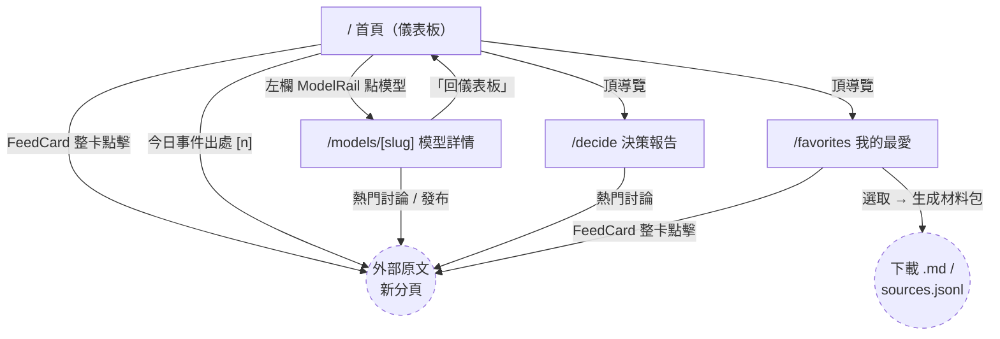

# UX 研究 03 — 資訊架構與使用流程（IA & Flows）

> 研究方法：以 `web/app/`、`web/components/`、`web/lib/` 程式碼為準逐檔走查（2026-06-12）。
> 對照基準：`docs/ux/positioning-c-ux.md`（定位 C：每日實用情報為面、模型當篩選）。
> 本文只記錄事實與提案，不改程式碼。

---

## 1. 現有 IA（以程式碼為準）

### 1.1 路由清單

| 路由 | 檔案 | 內容 | 進入方式 |
|------|------|------|---------|
| `/` | `web/app/page.tsx` | 首頁：Hero + 左欄模型列 + 篩選列 + 摘要列 + 今日事件 + 5 主題看板 + 右欄熱詞 | 導覽「儀表板」/ Logo |
| `/favorites` | `web/app/favorites/page.tsx` | 我的最愛（localStorage）＋選取→生成知識材料包→下載 | 導覽「我的最愛」 |
| `/decide` | `web/app/decide/page.tsx` | 決策報告：勾模型＋議題 → 口碑/討論量比較＋建議 | 導覽「決策報告」 |
| `/models/[slug]` | `web/app/models/[slug]/page.tsx` | 模型詳情：指標、趨勢圖、近期事件、熱門討論、發布 | 首頁左欄 ModelRail |

**定位文件規劃了、但實際不存在的路由**：`/theme/[label]`（主題列表頁）、`/query`（查詢頁）、`/post/[id]`（單篇頁）。
也就是說：**產品主軸「主題」在路由層完全沒有落點**——主題只以首頁看板欄位存在，每欄硬上限 4 張卡（`page.tsx` → `getFeed(filters, 4)`）。

**電子報**：`web/` 全域 grep「電子報|newsletter|subscribe|訂閱」零命中。後端每日電子報已存在（pipeline），但前端 IA 中**沒有任何訂閱入口、預覽或過刊頁**。

### 1.2 導覽結構

全站共用 `SiteHeader`（每頁手動引入，非 layout 級）：

- Logo → `/`
- `SiteNav`（`site-nav.tsx`）三連結：**儀表板 `/`、我的最愛 `/favorites`、決策報告 `/decide`**
- `/models/*` 沒有自己的導覽項，active 狀態歸給「儀表板」（程式註解：同一條探索動線）
- `SiteFooter`：純署名，無任何連結（也無電子報入口）

### 1.3 頁面跳轉關係



文字樹（含首頁區塊層級）：

```
/（儀表板＝每日實用情報門面）
├── Hero（靜態價值主張，每天相同）
├── 左欄：依模型瀏覽（ModelRail）──→ /models/[slug]
├── FeedFilter：模型 chip ×7 ＋ 情緒/來源/時間下拉
│     └── 寫入 URL ?model=&sentiment=&source=&days=（router.replace）
├── FeedSummary：5 主題計數列（吃 filter）
├── 今日事件（TodayEvents）：事件摘要卡 ──→ 外連出處（不吃 filter、不能收藏）
├── ThemeFeed：5 主題 kanban，每欄固定 4 張 FeedCard
│     └── FeedCard ──→ 外連原文（無站內詳情頁）＋ ♥ 收藏
└── 右欄：本週熱詞（TrendingPanel，純顯示、不可點擊篩選）

/favorites ── 工具列（全選/AI蒸餾/生成）→ PackResult（下載/複製/預覽）
/decide ──── GET form（?models=&topic=）→ 建議卡 + 模型列
/models/[slug] ── 指標 → 趨勢 → 近期事件 → 熱門討論 → 最新發布 → 回儀表板
```

### 1.4 IA 演化殘留（死代碼）

以下元件在 `web/` 內**零引用**（舊「口碑看板」定位殘留）：`model-board.tsx`、`events-feed.tsx`、`events-filter.tsx`、`releases-feed.tsx`、`today-summary.tsx`、`how-to-use.tsx`。它們不影響使用者，但反映 IA 改版未收尾；其中 `how-to-use.tsx` 的「怎麼用」內容恰好是旅程 (c) 缺的引導素材。

---

## 2. 三個核心使用者旅程走查

### 旅程 (a)「每日 5 分鐘看重點」：進站 → 看今日事件 → 掃 feed → 離開

| 步驟 | 操作 | 點擊數 | 程式碼事實 |
|------|------|--------|-----------|
| 1 | 進站 `/` | 0 | 預設 `days=1`（只看今日）✅；但**第一屏先吃 Hero**（每天回訪都看到同一段價值主張） |
| 2 | 看今日事件 | 0（捲動） | TodayEvents 在 ThemeFeed 之上，位置正確；後端沒事件時退空狀態不掛頁 ✅ |
| 3 | 掃 5 主題 | 0（捲動） | kanban 5 欄只在 `xl`（≥1280px）成立；筆電 `lg` 是 3 欄 → 變 2 列要多捲一屏 |
| 4 | 點開有興趣的 1–2 則 | 各 1 | 整卡 stretched link 開新分頁，回站狀態不丟 ✅ |

**結論：點擊數已是理想（0 點看完、1 點深入），問題在「重點浮上來的速度」：**

- **斷點 a-1（首屏密度）**：回訪者每天重看 Hero。Hero 對新訪客有用、對日活核心用戶是固定成本。今日事件（產品差異化核心）被擠到第二屏。
- **斷點 a-2（篩選範圍不一致）**：`FeedFilter` 收斂 FeedSummary 與 ThemeFeed，但 **TodayEvents 不吃任何 filter**（`getTodayEvents()` 無參數）。使用者選了 Claude，今日事件照樣顯示全部——同一頁兩套範圍規則。
- **斷點 a-3（空狀態無逃生口）**：主題欄空時只顯示「這類目前沒有新內容。」純文字；定位文件 §5 明定要給「看看近 7 天 →」行動連結，未實作。
- **斷點 a-4（熱詞是死的）**：右欄本週熱詞純顯示，點不了——看到熱詞想深入，IA 沒有下一步。

### 旅程 (b)「找特定主題情報」：篩主題/來源 → 翻列表 → 看詳情

| 步驟 | 期望操作 | 實際 | 程式碼事實 |
|------|---------|------|-----------|
| 1 | 篩「主題」 | **做不到** | 主題不是篩選維度（filter 只有 model/sentiment/source/days），也沒有 `/theme/*` 路由；只能捲動到該欄 |
| 2 | 翻列表 | **做不到** | 每主題固定 `limit_per_theme=4`；把時間放寬到 90 天**仍然只有 4 張卡**，沒有「看全部」、沒有分頁 |
| 3 | 看詳情 | 1 點 | 無站內單篇頁，詳情＝外連原文（可接受，開新分頁狀態不丟） |

**篩選狀態會不會丟失？**

- ✅ **URL 有帶參數**：`?model=&sentiment=&source=&days=`，可分享、重新整理不丟（`feed-filter.tsx` 寫 searchParams，首頁 Server Component 讀取）。
- ⚠️ **不可後退**：`feed-filter.tsx` 用 `router.replace`，篩選變更**不產生歷史紀錄**——按上一頁會直接跳離首頁，與 `page.tsx` 註解宣稱的「可後退」不符。
- ❌ **跨頁丟失**：從首頁（已篩 Claude）點左欄進 `/models/claude` 再「回儀表板」，連結是寫死的 `href="/"`（`BackLink`）→ **篩選全部歸零**。

**結論：旅程 (b) 是三條旅程中斷得最徹底的——主題是定位 C 的主軸，但「沿主題深入」這條路在第 4 張卡就到頭（無限大點擊也到不了第 5 則）。** 另外站內完全沒有關鍵字搜尋，「找特定情報」只能靠 4 個維度交集碰運氣。

### 旅程 (c)「收藏 → 產出材料包」：收藏散落各頁 → favorites → 選取 → 生成 → 下載

| 步驟 | 操作 | 點擊數 | 程式碼事實 |
|------|------|--------|-----------|
| 1 | 各處點 ♥ 收藏 | 每則 1 | ♥ 只存在於 `FeedCard`（首頁 5 主題欄、favorites 頁） |
| 2 | 進我的最愛 | 1 | 頂導覽常駐 ✅；空狀態文案有教「在卡片右上角點 ♥」✅ |
| 3 | 選取 | 1（全選）或逐張 | 工具列 sticky、已選計數清楚 ✅；收藏變動會自動清掉失效選取 ✅ |
| 4 | 生成 | 1 | 「AI 蒸餾」開關有 title 說明 ✅；busy 狀態只有「生成中…」，**地端 LLM 蒸餾可能跑數十秒，無進度/預估** |
| 5 | 下載 | 1–2 | .md ＋ sources.jsonl 各一鍵，另有複製/預覽 ✅ |

收藏後快樂路徑：1（導覽）+1（全選）+1（生成）+1（下載）= **4 點**，流程本身順。斷點在頭尾：

- **斷點 c-1（收藏入口不一致）**：可收藏的只有 FeedCard。**今日事件卡（`EventSummaryCard`）不能收藏**——產品最有價值的「事件＋忠實摘要」反而進不了材料包；`/models/[slug]` 熱門討論、`/decide` 熱門討論同樣沒有 ♥。使用者學到的規則（右上角有愛心）只在一種卡片上成立。
- **斷點 c-2（結果不持久）**：`pack` 只存在 React state——生成後重新整理或切頁，材料包消失，得重新生成（蒸餾要重跑一次地端模型）。
- **斷點 c-3（生成後無引導）**：PackResult 給下載/複製就結束。材料包定位是「做 skill / agent 的素材」，但沒有任何「下一步怎麼用」的指引（恰好有個未使用的 `how-to-use.tsx`）。
- **斷點 c-4（文案矛盾的小傷）**：favorites 空狀態說「每週清空不影響」，這是內部資料視窗的概念，訪客沒有上下文，反而引發「什麼會被清空？」的焦慮。

---

## 3. 現有 IA 的問題評估

| # | 問題 | 嚴重度 | 證據 |
|---|------|--------|------|
| P1 | **主軸無層級：主題只有「首頁欄位」一層，太平** | 高 | 無 `/theme/*`、無「看全部」、每欄硬上限 4；定位文件 §3/§4.2 規劃的主題列表頁未建 |
| P2 | **模型軸三入口語意不互斥** | 中高 | 「點模型 chip（留在首頁篩選）」「左欄 ModelRail（跳模型詳情頁）」「決策報告（比較頁）」三條路都叫「看某模型」，結果完全不同；`/models/*` 的 nav active 又歸「儀表板」 |
| P3 | **首頁承載過多** | 中 | 7 個區塊（Hero/左欄/filter/摘要列/今日事件/5 欄看板/熱詞）；Hero 對日活用戶是每日固定成本；今日事件被擠到第二屏 |
| P4 | **命名殘留舊定位** | 中 | 導覽叫「儀表板」（舊口碑看板心智），Hero 卻說「每日實用情報」；「決策報告」與「模型詳情」內容重疊（口碑、熱門討論兩處都有），不互斥 |
| P5 | **電子報在 IA 缺席** | 高 | 前端零入口；每日電子報是五大核心功能之一，與「每天回來看」的留存閉環直接相關 |
| P6 | 篩選狀態跨頁丟失、replace 不可後退 | 中 | `BackLink` 寫死 `/`；`router.replace` 無歷史 |
| P7 | 今日事件不吃 filter（單頁兩套範圍規則） | 中 | `getTodayEvents()` 無 filter 參數 |
| P8 | 收藏入口不一致（事件卡/模型頁/決策頁不可收藏） | 中高 | ♥ 只在 `FeedCard` |
| P9 | 熱詞不可點、無站內搜尋 | 低中 | `TrendingPanel` 純顯示 |
| P10 | 死代碼未清（舊 IA 殘留 6 個孤兒元件） | 低 | §1.4 |

---

## 4. 改善後的 IA 提案

### 案 A（推薦，小改）：補上主題層，收斂模型入口，給電子報一個家

延續現有單頁門面，補齊定位文件已規劃但未建的層級。改動集中在「新增路由＋導覽改名」，首頁版型基本不動。

**路由表**

| 路由 | 性質 | 內容 |
|------|------|------|
| `/` | 既有，微調 | 改名「今日」；Hero 縮為一行（或首訪才展開）；今日事件升到第一屏；每主題欄底加「看全部 (N) →」 |
| `/theme/[label]?model=&sentiment=&source=&days=&page=` | **新增** | 主題列表頁：同一條 filter 列＋完整列表（分頁/無限捲動），進入時**繼承首頁當前 filter** |
| `/models/[slug]` | 既有，重定位 | 依定位 §4.4 改成「該模型的主題切片」（5 主題各 N 則＋列表），口碑/趨勢退為頁內小區塊；「回上頁」改 `router.back()` 或帶回 filter |
| `/decide` | 既有，降級 | 從主導覽移除，入口改放 `/models/[slug]` 頁內「和其他模型比較 →」 |
| `/favorites` | 既有，補強 | 材料包結果存 `localStorage`（歷史清單）；PackResult 加「下一步：怎麼變成 skill」引導區（復用 how-to-use 素材） |
| `/newsletter` | **新增** | 電子報：訂閱表單＋最近一期預覽（後端已有產製內容）；入口＝導覽末項＋ footer ＋材料包生成完成後 CTA「以後每天寄給我」 |

**導覽設計**

```
Logo | 今日  主題 ▾（新工具/模型動態/使用方法/風險限制/倫理法規） 我的最愛  電子報        Live
                └─ 下拉直達 /theme/[label]；/models/* active 歸「主題」或自立麵包屑
```

同步修復：♥ 加到 `EventSummaryCard` 與模型頁/決策頁討論列；TodayEvents 吃同一組 filter；主題欄空狀態加「看看近 7 天 →」（連到 `/theme/[label]?days=7`）；熱詞可點 → `/theme/全部?q=詞`（或先連該詞的來源列表）。

**旅程點擊數對比（案 A）**

| 旅程 | 現況 | 案 A 後 |
|------|------|--------|
| (a) 每日 5 分鐘 | 0 點可掃，但今日事件在第二屏、Hero 占首屏 | 0 點，今日事件第一屏；掃完即離開 |
| (b) 找主題情報 | 第 4 則之後**無路可走（∞）**；跨頁篩選丟失 | 1 點（看全部）進完整列表，filter 隨行；後退可回 |
| (c) 收藏→材料包 | 收藏後 4 點，但事件不可收藏、結果不持久 | 收藏後 4 點不變；事件可收藏、材料包留存＋下一步引導＋電子報 CTA 收尾 |

### 案 B（大改）：三層心智模型「今日 / 圖書館 / 工作台」

如果之後要加搜尋與更多查詢維度，再把 IA 重組為「時間性 vs 累積性 vs 個人性」三區，避免首頁無限長胖。

**路由表**

| 路由 | 內容 |
|------|------|
| `/` 今日 | 純 briefing：今日事件＋各主題今日 top 3＋本週熱詞。目標：5 分鐘掃完即走，無 filter（要深入就去圖書館） |
| `/library?theme=&model=&sentiment=&source=&days=&q=` 圖書館 | 唯一的查詢/列表頁：主題 tab ×5 為第一級、其餘為 filter、加關鍵字搜尋；取代 `/theme/*`＋`/query`＋模型切片（`/models/[slug]` 變成 `/library?model=claude` 的捷徑＋口碑摘要側欄） |
| `/workbench` 工作台 | 我的最愛＋材料包生成＋**材料包歷史**＋「用材料包做 skill」教學 |
| `/newsletter` | 訂閱＋過刊 |

**導覽**：`今日 / 圖書館 / 工作台 / 電子報` —— 四個詞互斥（時間性內容 / 累積性內容 / 個人產出 / 投遞通道），「儀表板」「決策報告」兩個舊定位詞彙退場。

**旅程點擊數對比（案 B）**

| 旅程 | 現況 | 案 B 後 |
|------|------|--------|
| (a) | 0 點，但首頁 7 區塊互相爭注意力 | 0 點，首頁只剩 briefing（區塊 7→3），重點最快浮上來 |
| (b) | 不可能（∞） | 1 點（導覽進圖書館）＋1 點（主題 tab）＝2 點到完整列表；q= 支援關鍵字 |
| (c) | 收藏後 4 點 | 收藏後 4 點不變；歷史包 0 點可回看 |

**取捨**：案 B 旅程 (b) 比案 A 多 1 點（少了首頁直達欄位的捷徑），換來的是首頁極簡與單一查詢面；需要後端補搜尋端點。**建議先做案 A**（與定位文件 §3 規劃一致、改動面小），等搜尋需求成立再演進到案 B——兩案路由可平滑遷移（`/theme/[label]` → `/library?theme=` 做 redirect）。

---

## 附錄：本研究走查過的關鍵檔案

- 路由：`web/app/page.tsx`、`web/app/favorites/page.tsx`、`web/app/decide/page.tsx`、`web/app/models/[slug]/page.tsx`（＋ `not-found.tsx`）、`web/app/sitemap.ts`
- 導覽：`web/components/site-header.tsx`、`web/components/site-nav.tsx`、`web/components/site-footer.tsx`
- 旅程 (a)(b)：`web/components/hero-intro.tsx`、`feed-filter.tsx`、`feed-summary.tsx`、`today-events.tsx`、`theme-feed.tsx`、`theme-meta.tsx`、`feed-card.tsx`、`model-rail.tsx`、`trending-panel.tsx`、`web/lib/api.ts`
- 旅程 (c)：`web/components/favorite-button.tsx`、`favorites-list.tsx`、`web/lib/favorites.ts`、`web/lib/pack.ts`
- 孤兒元件：`web/components/{model-board,events-feed,events-filter,releases-feed,today-summary,how-to-use}.tsx`
